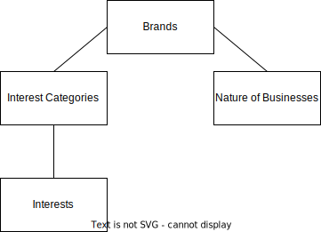

# DMG Events Form Spec

This repo contains the compiled set of specifications and sample data, documenting the ideal state of each form types.

## File Structure

`fields.md`: contains the specification for each field.

`templates/`: form templates for each different user journeys (sales lead generation, registration).

`data/core/`: contains the business data model of how each brand picks from a list of interests, nature of businesses, etc...

## Form Data Modelling & Design

### Brands

At the data level, brands would dictate how its data sources for its "Interests" and "Nature of Business" questions on the form will be supplied.

For the "Nature of Business" sources, out of all the business natures, it would simply try to pick them individually (See [fieldSources.businessNatures](./data/core/brands.json)).

As for the "Interest" sources, out of all the interests, it would try to pick the subset of the list based on its category (See [fieldSources.interestCategories](./data/core/brands.json)). So for example, when the brand picks an interest category, it's saying that it wants to include all the interests under this category.

### Challenges

There are a couple of challenges in representing the fields in a form:

1. There are entries of the same label in the "Interest" data but belong to different categories (e.g. `Accessories` in `Accessories / Décor And Homeware` category but also in `Abrasives / Adhesives And Coatings` category). Representing them on the form whilst distinguishing them apart requires adding the interest's category as part of the final label, when choosing from the list of options in the form.

## Example Form Links

This section contains examples of existing forms. They are a good reference in how the fields should generally look and the types of fields they have but is a bad reference for how a form template spec is made since the existing forms are inconsistent.

**Visitor Registration**

- https://register.designfairasia.com/Public/Registration.aspx

**Sales Lead Generation**

- https://www.future-mobility.asia/contact-us

**Brochure Downloads**

- https://www.canadagaslng.com/forms/download-conference-preview
